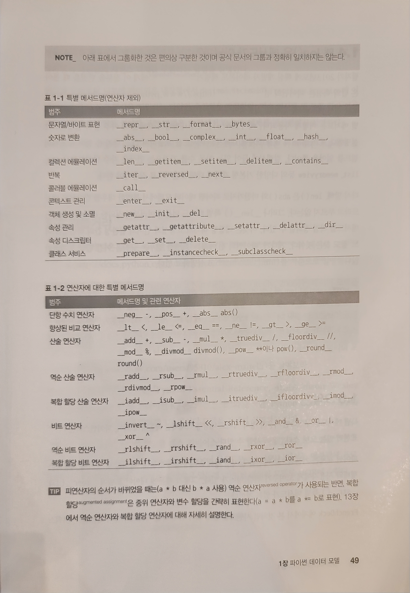

# 제 1장 파이썬 데이터 모델
## 파이썬 카드 한 벌 (`ex1-1.py`)
특별 메서드 (special method) 또는 매직 메서드 (magic method)는 파이썬 내부적으로 구현된 built-in 메서드로서 메서드 이름 양 옆이 `__`로 둘러 쌓여 있다. 따라서 앞뒤로 이중 언더바를 가진 형태의 속성명은 피하는 것이 좋다.
- (ex) `__getitem__()`, `__len__()`
  - `__getitem__` 메서드와 `__len__` 메서드를 구현하면 클래스가 표준 파이썬 시퀀스처럼 작동할 수 있다. 따라서 `random`의 `choice()`, `reversed()`, `sorted()`  함수를 사용할 수 있다.

 

## 1.2 특별 메서드는 어떻게 사용되나? (`ex1-2.py`)
특별 메서드는 파이썬 인터프리터가 호출하기 위한 것이다. 사용자는 특별 메서드를 정의만 해주고 내장 함수를 호출하는 것이 좋다. 직접 특별 메서드를 호출하는 상황은 지양하자. (클래스 내부에서도 호출하지 않는다.)
-  `my_object.__len__()` -> 벌점 1점 
- 예외적으로 `__init__()`는 슈퍼클래스의 `__init__()` 메서드 호출할 때 많이 호출된다.

 

파이썬 내장 자료형 (`list`, `str`, `bytearray` 등)은 더욱 쉬운 방법으로 연산을 수행한다.

- `__abs__(self)`: 인스턴스의 크기나 절댓값
- `__add__(self, sth)`: `+` 연산을 정의한다. 
  - 인스턴스가 왼쪽 `sth`가 오른쪽에 위치해야 한다. `__radd__(self, sth)`으로 인스턴스가 오른쪽에 있는 경우를 정의할 수 있다.
- `__mul__(self, sth)`: `*` 연산을 정의한다. 
  - 인스턴스가 왼쪽 `sth`가 오른쪽에 위치해야 한다. `__rmul__(self, sth)`으로 인스턴스가 오른쪽에 있는 경우를 정의할 수 있다.
- `__repr__(self)`: 객체를 문자열로 표현. 내장 메서드 `repr()`에 의해 호출된다. 가능하면 표현된 객체를 재생성하는 데 필요한 소스코드와 일치해야 한다.
  - (ps) `__str__(self)`는 `str()` 생성자에 의해 생성되며 `print` 함수에 의해 암묵적으로 사용된다. 사용자에게 보여주기 적당한 문자열을 반환해야 한다. 
  - 디버깅 및 로그에 사용하는 형태와 사용자에게 보여주기 위한 형태를 제공해준다.
  - 둘 중 하나를 구현해야 한다면, `__repr__(self)`를 구현하는 것이 좋다. `__str__(self)`가 구현되지 않았다면 `__repr__(self)`를 호출하기 때문이다. 하지만 `__repr__(self)`이 구현되지 않았다고 `__str__(self)`을 호출하진 않는다.
- `__bool__(self)`: 객체의 논리 값을 부여, 정의하지 않을 경우 `True`로 간주한다.

 

## 1.3 특별 메서드 개요
파이썬 공식 문서의 "[데이터 모델 (Data Model)](https://docs.python.org/3/reference/datamodel.html)"장에서는 83개의 특별 메서드를 소개하고 있다. 다음은 전문가를 위한 파이썬 49pg에 특별 메서드 목록을 보여주고 있다. 아래 특별 메서드는 책의 모든 부분에서 설명을 할 예정이라고 한다.

 

클래스를 사용하여 자신만의 객체 (사용자 정의 객체)를 만들 때, 특별 메서드를 잘 정의해주면 마치 내장형 객체 (`List`, `Dict` 등)가 작동하는 것처럼 파이썬스럽게 구현할 수 있다.
